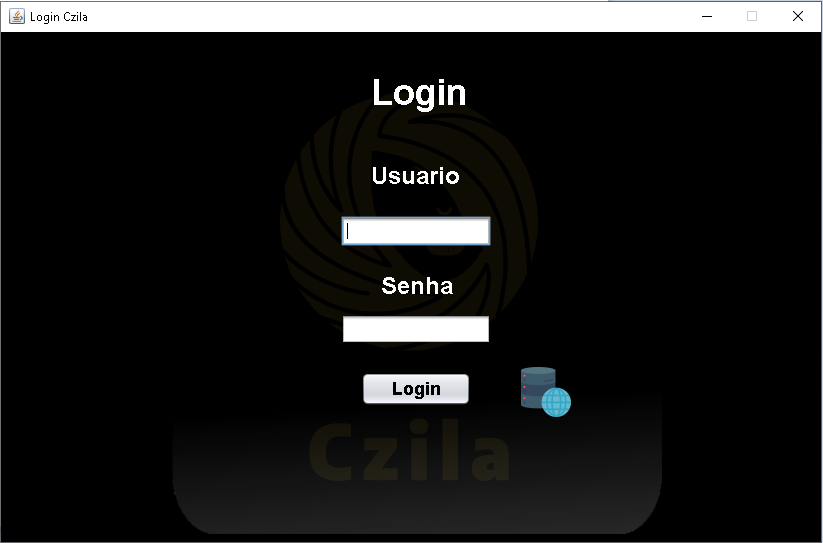
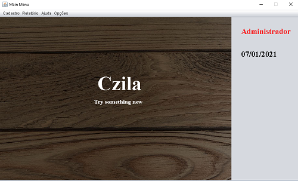
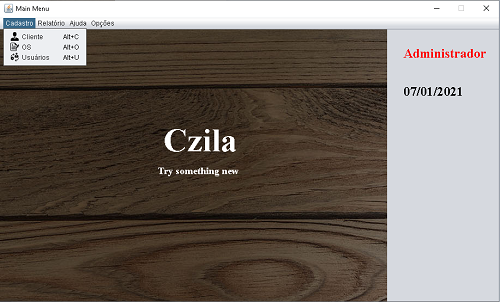
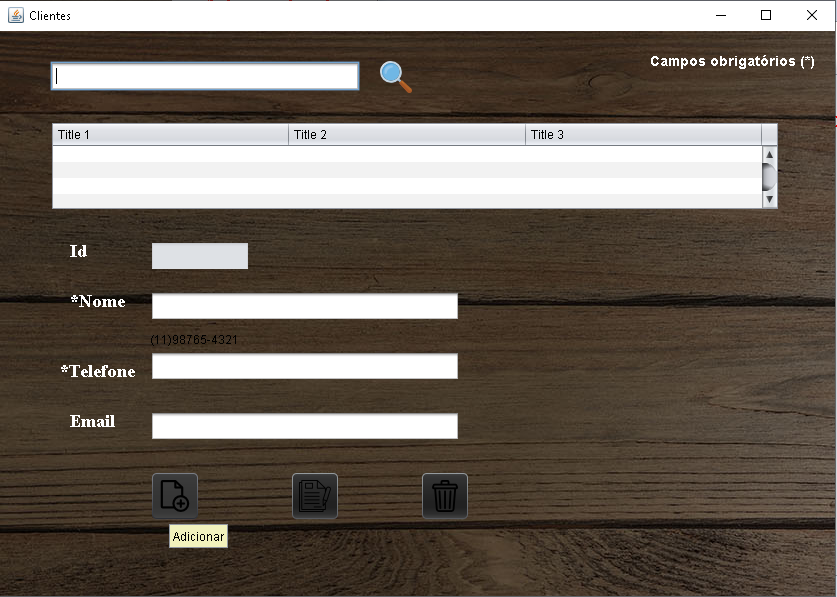
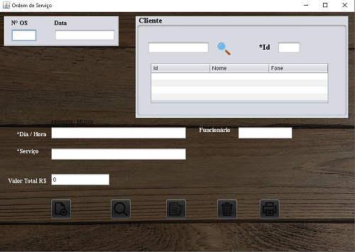
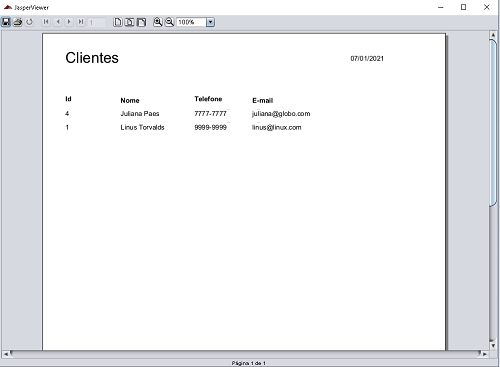

# Cezila-Project

Service order issuance program.
In this program you can register: 
- users
- customers
- employees
- services performed.

The program was originally designed for a beauty salon but has functions for general use in other establishments.

Inside the HairSalonProject folder there is a notepad with instructions for installing the program.

# Screenshots

# Support

If you've found an error in this sample, please file an issue: https://github.com/VitorCezila/cezila-project/issues

Patches are encouraged, and may be submitted by forking this project and submitting a pull request through GitHub.
